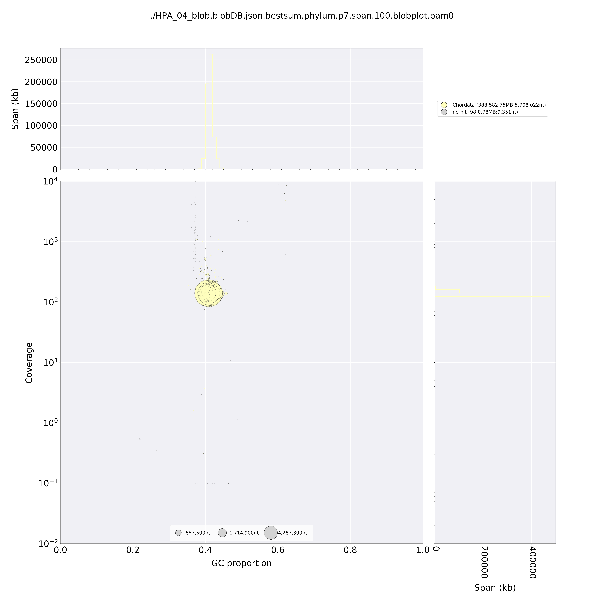
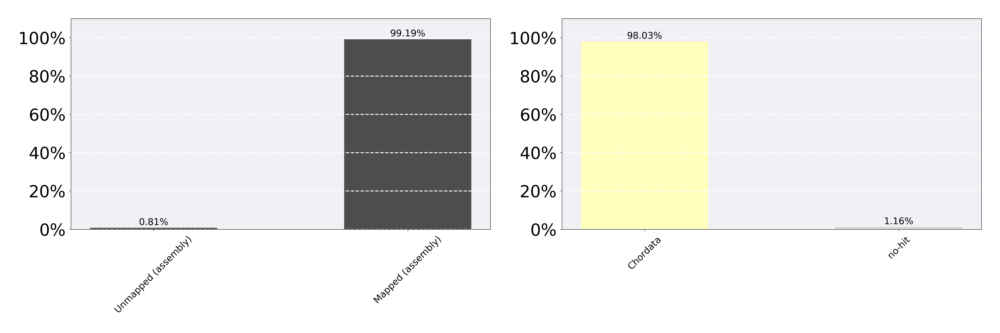
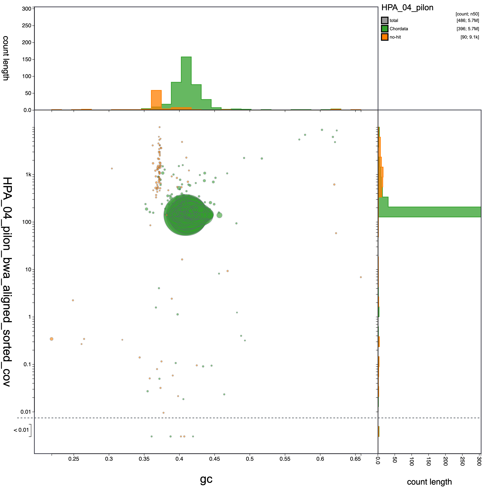
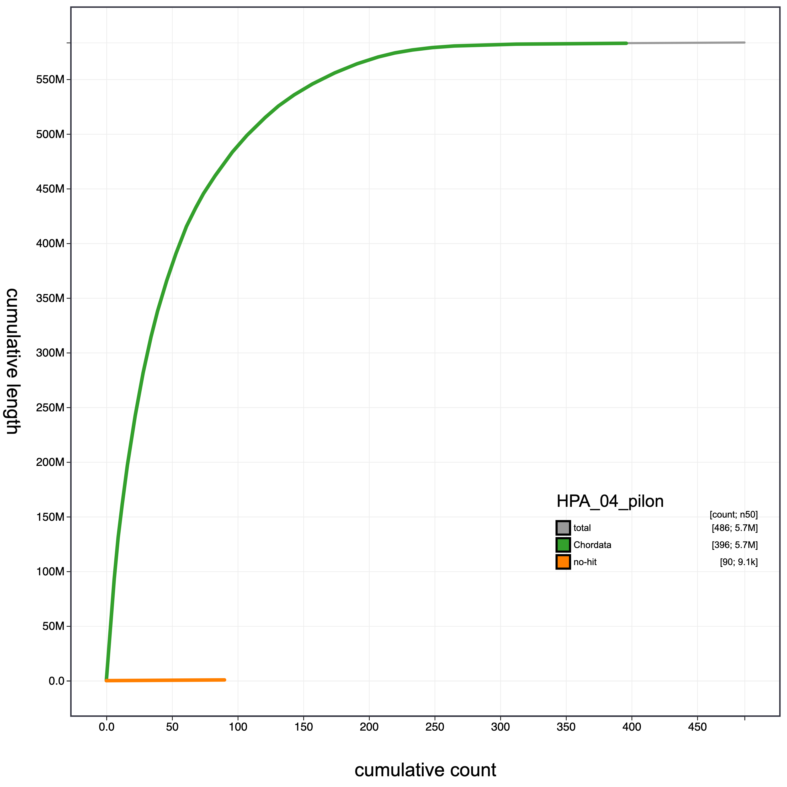
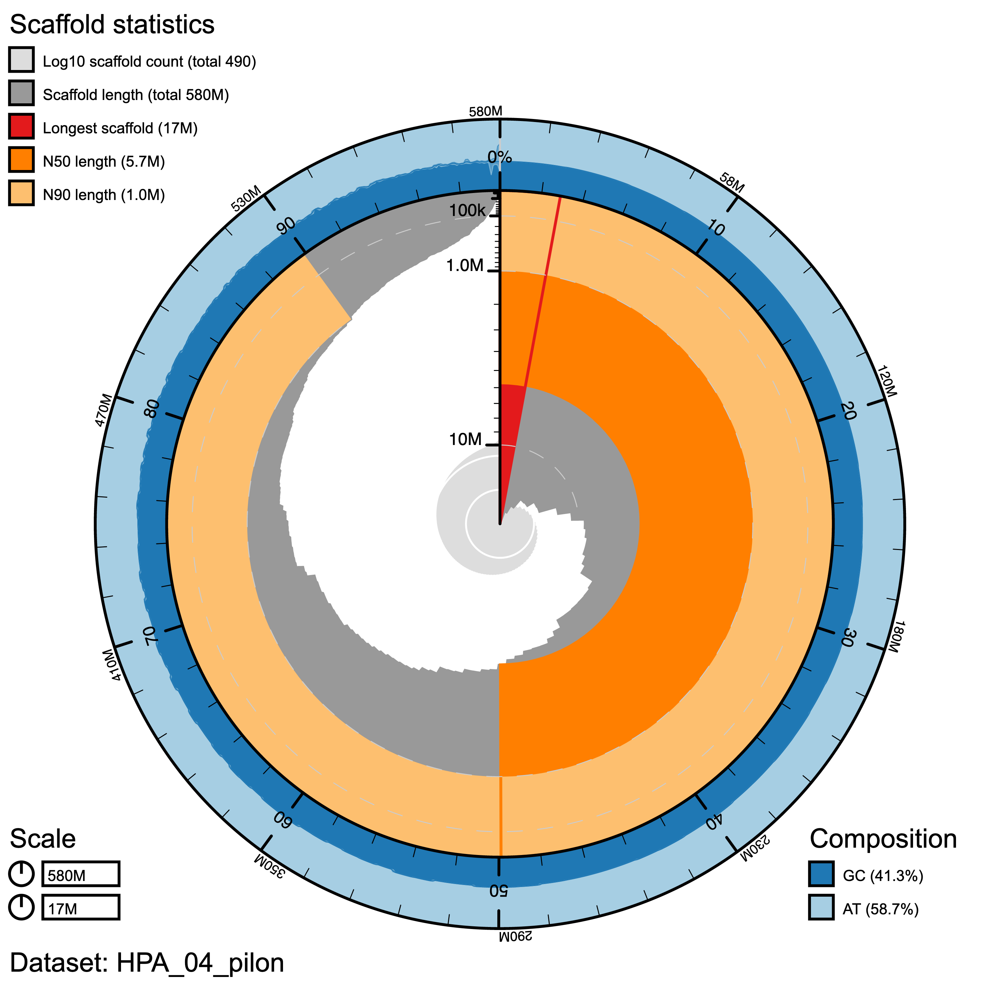

# Genome de contamination Analysis

This is an [R Markdown](http://rmarkdown.rstudio.com) Notebook for de_contamination analysis in genome assembly projects. Here, I explain how to run two different de-contamination programs (kraken2 and blobtools).


### Kraken2

What is kraken2?

Is  "a taxonomic sequence classifier that assigns taxonomic labels to DNA sequences. Kraken examines the k-mers within a query sequence and uses the information within those k-mers to query a database. That database maps k-mers to the lowest common ancestor (LCA) of all genomes known to contain a given k-mer". (https://github.com/DerrickWood/kraken2/wiki/Manual#special-databases)

To run kraken2 you need your genome assembly and the index fai file for the assembly.

```{bash eval=FALSE, include=T}
# /bin/sh
# ----------------Parameters---------------------- #
#$ -S /bin/sh
#$ -q mThC.q
#$ -pe mthread 12 -l mres=48G,h_data=4G,h_vmem=4G
#$ -cwd                                                      
#$ -j y
#$ -N kraken
#$ -o kraken.log
#$ -m bea
#$ -M ariasc@si.edu
#
# ----------------Modules------------------------- #
module load bioinformatics/kraken
#                                                       
# ----------------Your Commands------------------- #
#
echo + `date` job $JOB_NAME started in $QUEUE with jobID=$JOB_ID on $HOSTNAME
echo + NSLOTS = $NSLOTS
#
kraken2 --db /data/genomics/db/Kraken/kraken2_db/ --report kraken_report_remi --use-names --confidence --threads $NSLOTS /scratch/genomics/ariasc/ariasc_pool/krake2/HPA_04_pilon.fasta
#
echo = `date` job $JOB_NAME done
```

**Kraken Output**

*Holocanthus passer*

- 486 sequences (583.53 Mbp) processed in 295.263s (0.1 Kseq/m, 118.58 Mbp/m).
- 413 sequences classified (84.98%)                                                     73 sequences unclassified (15.02%)
  
#### Exploring kmers distribution for classified sequences. 

First we will get only the list of contigs and its classification

```{bash eval=FALSE, include=T}
grep "Contig" kraken2.log > kraken2_results.txt
```

Get list of human and unclassified contigs: By doing this, we are removing anything classified as bacteria, plasmids or viruses. We keep the unclassified because they might contain real contigs.

```{bash eval=FALSE, include=T}
grep "unclassified\|Homo sapiens" kraken2_results.txt | cut -f2 > assembly.fa.HsU.list
```

In order to explore kraken resuls, I download the results files and I use R to explore.

```{bash eval=FALSE, include=T}
module load bio/rclone
rclone copy kraken2_results.txt db3:hydra_backup/
```

Exploring the results in R.

```{r include=FALSE}
library(dplyr)
library(kableExtra)
```

```{r eval=T, include=T}
kraken_results<-read.delim("kraken2_results_remi.txt", header = F)
colnames(kraken_results) <-  c("Classification", "contig", "taxon", "length", "kmers")

sub_kraken_results <- filter(kraken_results, taxon !="Homo sapiens (taxid 9606)" & taxon !="unclassified (taxid 0)")

sub_kraken_results %>% kbl() %>% kable_styling()
#sum(sub_kraken_results$length)
#100222 ~100Kbp
```
Kraken2 found ten contigs contaminated with bacteria and archea. This 10 contigs made 100kbp.

#### Filtering scaffolds with contamination

Using samtools, we will extract from the assembly only the contigs identified as Human or unclassified. Bacteria, viruses and plasmids will be excluded.

```{bash eval=FALSE, include=T}
module load bioinformatics/samtools
xargs samtools faidx original_assembly.fa < assembly.fa.HsU.list > new_assembly.fa
```

### Blobtools

What is blobtools?

Is "A modular command-line solution for visualisation, quality control and taxonomic partitioning of genome dataset" (https://github.com/DRL/blobtools)

#### Preparing files for blobtools

First, you need to blast your assembly to know nt databases. for this we will used blastn program. we will used our job file blast.job to the program in the server.

```{bash eval=FALSE, include=T}
# /bin/sh
# ----------------Parameters---------------------- #        
#$  -S /bin/sh      
#$ -pe mthread 12       
#$ -q mThC.q                                                  
#$ -l mres=96G,h_data=8G,h_vmem=8G       
#$ -cwd
#$ -j y                             
#$ -N acti_blast    
#$ -o acti_blast.log      
#$ -m bea 
#$ -M ariasc@si.edu                                 
#     
# ----------------Modules------------------------- #
module load bioinformatics/blast        
#     
# ----------------Your Commands------------------- #      
#  
echo + `date` job $JOB_NAME started in $QUEUE with jobID=$JOB_ID on $HOSTNAME
echo + NSLOTS = $NSLOTS 
blastn -db /data/genomics/db/ncbi/db/latest_v4/nt/nt -query HPA_04_pilon.fasta -outfmt "6 qseqid staxids bitscore std" -max_target_seqs 10 -max_hsps 1 -evalue 1e-20 -num_threads $NSLOTS -out HPA_blast.out
#                               
echo = `date` job $JOB_NAME done
```

Second, you need to map raw reads to the genome assembly. We used bwa to map and samtools to convert from sam to ban and finally sort the bam file.

```{bash eval=FALSE, include=T}
#Index genome assembly
bwa index -p HPA_04_pilon.fasta

#run bwa
bwa mem -t $NSLOTS reads/HPA_04_R1.fastq reads/HPA_04_R2.fastq > HPA_04_pilon_bwa.sam
#comvert to bam and sort with samtools
samtools view -bu -@ $NSLOTS HPA_04_pilon_bwa.sam | samtools sort -T HPA_04 -O bam -@ $NSLOTS -l 9 -m 2G -o HPA_04_pilon_bwa_aligned_sorted.bam
```

#### Running blobtools

First, you need to create a database with blast and mapping files

```{bash eval=FALSE, include=T}
# /bin/sh                     
# ----------------Parameters------------#
#$ -S /bin/sh 
#$ -q mThM.q    
#$ -l mres=24G,h_data=24G,h_vmem=24G,himem
#$ -cwd 
#$ -j y 
#$ -N blob_create  
#$ -o blob_create.log   
#$ -m bea 
#$ -M ariasc@si.edu
#              
# ----------------Modules------------ #
module load bioinformatics/blobtools
#
# ----------------Your_Commands---- #
#
echo + `date` job $JOB_NAME started in $QUEUE with jobID=$JOB_ID on $HOSTNAME
#                                         
blobtools create \                        
  -i HPA_04_pilon.fasta \                 
  -t HPA_blast.out \                      
  -b HPA_04_pilon_bwa_aligned_sorted.bam \
  -o HPA_04_blob                          
#                                         
echo = `date` job $JOB_NAME done
```

Second to view/summarize results you need to process the .json file or you can directly plot the results.

```{bash eval=FALSE, include=T}
#you can used the interactive node in hydra since it do not uses to much memmory or time
qrsh
#to view results in as a table.
blobtools view -i HPA_04_blob.blobDB.json -o ./
#to plot results
blobtools plot -i HPA_04_blob.blobDB.json -o ./
```

This created two png files with the plots. Look at file in project folder.

```{r}

```

```{r}

```

### Bloobtools2

```{bash eval=FALSE, include=T}
qrsh -pe mthread 8
module load bio/blobtools/2.6.3 
#Create a BlobDir
blobtools create --fasta /scratch/genomics/ariasc/remy/blob/HPA_04_pilon.fasta HPA_04_pilon

#Add BLAST hits
blobtools add --threads 8 --hits /scratch/genomics/ariasc/remy/blob/HPA_blast2.out --taxrule bestsumorder --taxdump /scratch/genomics/ariasc/remy/blob/blopbtools2_run/taxdump HPA_04_pilon

#Add mapping coverage
blobtools add --threads 8 --cov /scratch/genomics/ariasc/remy/blob/HPA_04_pilon_bwa_aligned_sorted.bam HPA_04_pilon

#Download db HPA_04_pilon folder to desktop and run blobtools view 

rclone copy HPA_04_pilon db3:hydra_backup/

#Create interactive html page with the blobtools results. this command was run in my personal mac computer were I install blobtools2 using conda.
#activate conda enviroment for blobtools2
conda activate btk_env
./blobtools view --remote /Users/solracarias/Desktop/HPA_04_pilon

```

You can play with viewer to change colors on figures, tables etc. Figures and tables can be downloaded and visualized.

```{r}
#
#

```

***Blobtools Results***

- Total 486 (# of contigs),580Mb (sum length), 5.7Mb (N50) 
- Chordata 396 (# of contigs),580Mb (sum length), 5.7Mb (N50) 
- no-hit 90 (# of contigs),690kb (sum length), 9.1kb (N50)

```{r}
#

```

```{r}
#

```

```{r eval=T, include=T}
blob_results<- read.csv("bestsumororder_table.csv",header = T, sep = ",")
blob_results<-select(blob_results, -1)
blob_results_nohits <- blob_results %>% filter(bestsumorder_phylum=="no-hit")

Kraken_blob_results<- merge(blob_results, kraken_results, by.x ="id", by.y = "contig",  all.x=F, all.y=F)
filt_kraken_blob_results <- filter(Kraken_blob_results, taxon !="Homo sapiens (taxid 9606)" & taxon !="unclassified (taxid 0)")
filt_kraken_blob_results %>% kbl() %>% kable_styling()
```


